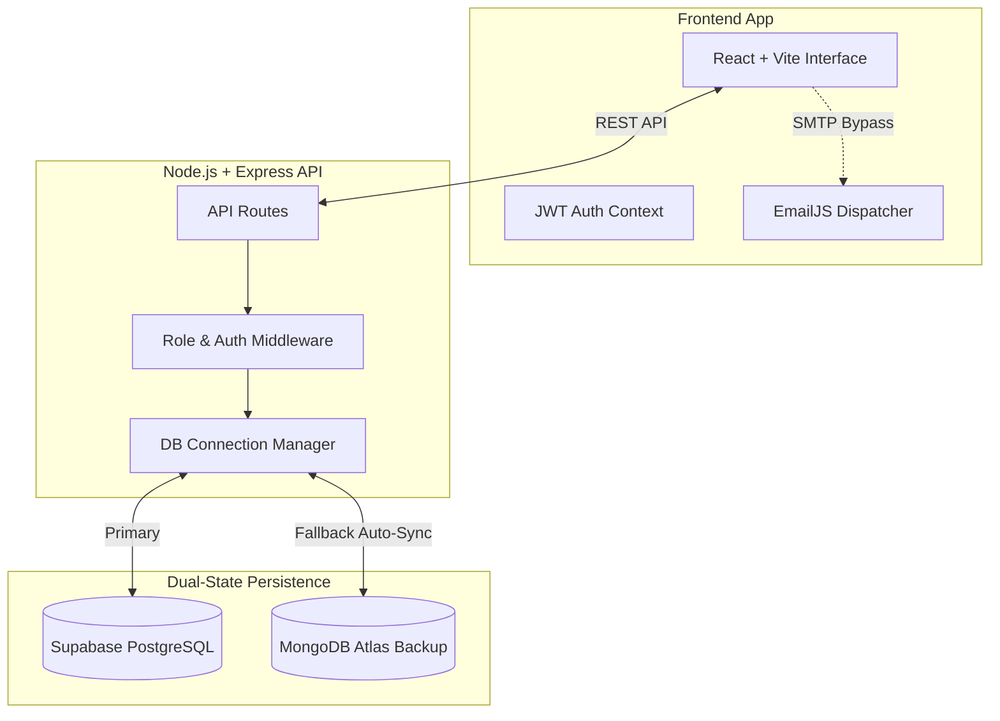

<div align="center">


# 🚀 PLM Flow
**Enterprise Product Lifecycle & Engineering Change Control System**

[](https://reactjs.org/)
[](https://nodejs.org/)
[](https://supabase.com/)
[](https://mongodb.com/)
[](https://tailwindcss.com/)

*An ultra-modern, fault-tolerant PLM system designed to streamline Engineering Change Orders (ECO), Bills of Materials (BoM), and inter-departmental approvals with uncompromising aesthetic precision.*

---

</div>

## ✨ God-Level Features

- 🛡️ **Dual-Database Failover Architecture**: Runs natively on **Supabase PostgreSQL**, with an automatic, instant failover mechanism to **MongoDB Atlas** if the primary database experiences downtime. Zero data loss.
- ⚡ **Real-Time SLA Tracking**: Visually stunning, dynamic SLA timers that track ECO approval stages down to the second, warning and escalating automatically.
- 🎨 **Premium Glassmorphic UI**: Engineered with Framer Motion, Tailwind CSS, and precise typography to deliver an Apple-like smooth user experience.
- 🔐 **Intelligent Role-Based Access Control**: Securely partitions functionality between *Admins, Engineering Users, Approvers, and Operations Users*.
- 📧 **Serverless Email Onboarding**: Instantaneous, non-blocking user credential dispatching via EmailJS directly from the frontend interface.
- 📄 **On-the-Fly PDF Generation**: Export highly detailed ECO reports directly to PDF from the dashboard.
- 🖼️ **Visual Diff Engine**: Side-by-side image comparison with visual review states (Approved/Rejected) built directly into the ECO workflow.

---

## 🏗️ System Architecture



---

## 📂 Repository Structure

This repository is designed as a Monorepo containing two distinct environments:

- 🎨 [**`/Frontend`**](./Frontend/README.md) — The Vite + React presentation layer.
- 🧠 [**`/backend`**](./backend/README.md) — The Node.js + Express core engine.

---

## 🚀 Quick Start Guide

### 1. Clone the repository
```bash
git clone https://github.com/your-org/odoo-x-gv-plm.git
cd odoo-x-gv-plm
```

### 2. Boot the Backend Server
```bash
cd backend
npm install
# Set up your .env file with DATABASE_URL, MONGO_URI, and JWT_SECRET
npm start
```

### 3. Spin up the Client Interface
```bash
cd ../Frontend
npm install
npm run dev
```
Open `http://localhost:5173` in your browser and log in with your Admin credentials!

---

## 🛡️ Security & Copyright

<div align="center">
  
**© 2026 PLM Flow. All Rights Reserved.**

*This proprietary software is strictly confidential. Unauthorized copying of this file, via any medium, is strictly prohibited. The UI/UX layout, dual-database failover algorithms, and specific animation sequences are protected intellectual property.*

Designed with ❤️ for absolute performance and reliability.
</div>
